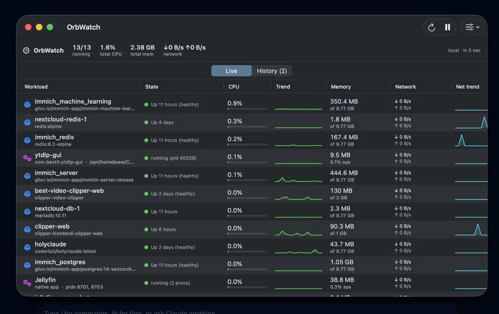

# OrbWatch

**A native macOS app for watching everything running on your Mac — Docker/OrbStack
containers *and* native background services — in one live dashboard.**

OrbWatch merges your container runtime and your local daemons into a single sortable
table with live CPU, memory, network throughput, block I/O, status, uptime, and rolling
per-row sparklines. It's a lightweight SwiftUI app (no Electron, no menu-bar clutter) that
builds with just the Command Line Tools.



## Why

If you self-host, your machine is usually a mix: some things run in **Docker/OrbStack**
(databases, web apps), some run **natively** (a launchd service, a media server like
Jellyfin). `docker stats` only sees half of it and Activity Monitor doesn't know what a
"container" is. OrbWatch shows both side by side, colour-coded by state, updating live.

## What it tracks

- **Docker / OrbStack containers** — merges `docker ps -a` (status, image, uptime,
  including *stopped* containers) with `docker stats` (CPU %, memory used/limit, net I/O,
  block I/O, PIDs), keyed by container name.
- **launchd services** — jobs whose label matches a configured prefix (default
  `com.besttt.`) and that have a live PID, with CPU/mem from `ps` and per-process network
  from `nettop` (no `sudo`).
- **Named native apps** — plain macOS apps matched by a process pattern, with **all of
  their PIDs aggregated into one row**. Ships tracking **Jellyfin**
  (`/Applications/Jellyfin.app`, which runs as a wrapper + server pair) — add your own
  in one line (see [Configuration](#configuration)).

## Features

- 🟢 **Live state** — colour-coded (running / restarting / paused / exited) with the full
  status string, refreshing every **1–10 s** (adjustable, pausable).
- 📊 **Per-row sparklines** — a 40-sample rolling CPU trend and a separate network-rate
  trend for every workload.
- 🌐 **Network throughput** — the Network column shows live **↓/↑ per second**, derived
  from the delta of cumulative byte counters between refreshes (a restart reads as `0`,
  not a spike). The header sums total throughput across everything.
- 🕑 **History tab** — workloads that **ran in the past but aren't running now** (stopped
  containers *and* ones removed entirely), with last status, last-running / last-seen
  times, and an observation count. Persisted to disk, so it survives restarts.
- 🔍 **Detail inspector** — click any row for net totals, block I/O, image, PIDs, and the
  full status string.
- ↕️ **Sortable columns** + a summary header (running count, total CPU, total memory,
  total network).
- 🖥️ **Local or remote** — read from this Mac directly, or point it at another Mac over
  SSH / Tailscale.

## Install / build

Requires the **Swift toolchain** (Xcode Command Line Tools is enough — no full Xcode) and
`docker` on your `PATH`.

```sh
# quick dev run (opens the window)
swift run

# build a double-clickable app bundle
./build-app.sh            # produces ./OrbWatch.app (icon embedded, ad-hoc signed)
./build-app.sh --install  # also copies it to /Applications

# headless sanity check of the data pipeline (no GUI) — prints the merged table
swift run OrbWatch --selftest
```

## Usage

Run it on the machine you want to watch and it sees Docker and processes **directly** — no
configuration needed. The toolbar has refresh-now, pause, and a settings menu (refresh
interval + data source). Switch between the **Live** and **History** tabs with the
segmented control under the summary bar.

### Watching another Mac (remote)

Open the settings menu (slider icon) → **Source: SSH host**, and enter the host (e.g. a
Tailscale MagicDNS name like `my-mac.tailnet-name.ts.net`). SSH runs in `BatchMode`, so
key-based auth (or Tailscale SSH) must already be set up — it will not prompt for a
password.

## Configuration

All knobs live in `Monitor.swift`:

| Setting | What it does |
|---------|--------------|
| `nativeApps` | macOS apps to track by process pattern. Add `NativeApp(name: "Plex", pattern: "/Applications/Plex Media Server")` etc. |
| `nativePrefixes` | launchd label prefixes to surface (default `["com.besttt."]`). |
| `intervalSeconds` | default refresh rate. |

A `NativeApp` matches with `pgrep -f <pattern>` and folds every matching PID into a single
row (CPU/mem/network summed, uptime taken from the longest-running PID).

## Permissions

- **Network per native process** uses `nettop`, which needs no `sudo`.
- Reading another volume / some process details may require **Full Disk Access**. Because
  the app is ad-hoc signed, that grant is bound to the binary's path — re-grant if you move
  `OrbWatch.app`.

## Architecture

| File | Role |
|------|------|
| `CommandRunner.swift` | Local / SSH command-execution abstraction |
| `DockerCollector.swift` | `docker ps` + `docker stats` → merged container rows |
| `ProcessCollector.swift` | `launchctl` + `pgrep`/`ps`/`nettop` → native service & app rows |
| `Models.swift` | `Workload` model + Docker stat-string / rate parsers |
| `Monitor.swift` | Polling loop, CPU+net history, net rates, aggregates (`ObservableObject`) |
| `History.swift` | Persistent store of past/stopped workloads (`~/Library/Application Support/OrbWatch/history.json`) |
| `ContentView.swift` | Live + History tabs, summary bar, toolbar, detail pane |
| `Sparkline.swift` | Per-row CPU / network trend chart |
| `AppIcon.swift` | Procedural gauge app icon (Dock icon + `.icns` export) |

Built with SwiftPM (`swift-tools-version:5.9`, `.macOS(.v14)`), SwiftUI `Table` +
`ObservableObject`. `@main enum Entry` in `Main.swift` dispatches to the GUI or the headless
`--selftest` / `--export-icon` modes.
